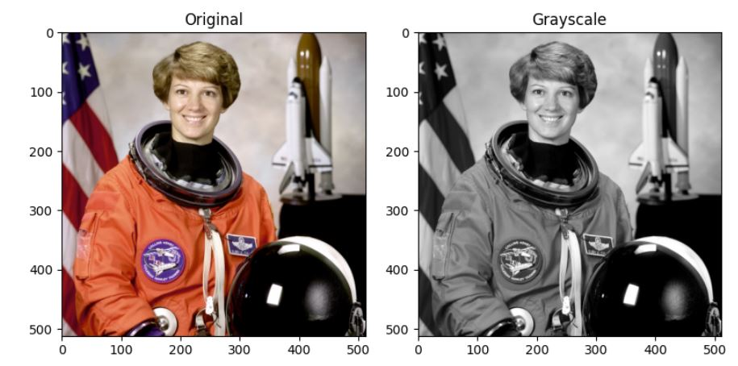

# Skikit-Image Package Overview

## Introduction

In this exploration activity we expand on a package that was already used in my first exploration activity Skikit-Image, an image processing package.

Although I could have chosen a brand new package to bring to this activity, I wanted to do this one because I wanted to see the more complex functionality of the package besides simply printing an image. I thought it was especially important to investigate this package further since it is the main driver of my program due to it being an image editing application.

## Skikit-Image (Skimage)

### Aspirations

"scikit-image aims to be the reference library for scientific image analysis in Python." [\[ref\]](https://scikit-image.org/docs/stable/about/values.html). Scikit-image has multiple goals in it's development but the main two are 1. being easy to use and install and 2. having a consistent API. When released in 2009, the team wanted skimage to be easily reusable by being careful when adding dependencies. [\[ref\]](https://ilovesymposia.com/2018/07/13/the-road-to-scikit-image-1-0/). 

### Code Examples

Skimage's website is amazing for showing examples on their site, which made it extremely easy for me to implement them into my own program.

Here are some of the many functionalities [\[ref\]](https://scikit-image.org/docs/stable/auto_examples/index.html):

### RGB to Grey-Scale

#### Source:
```python
import matplotlib.pyplot as plt

from skimage import data
from skimage.color import rgb2gray

original = data.astronaut()
grayscale = rgb2gray(original)

fig, axes = plt.subplots(1, 2, figsize=(8, 4))
ax = axes.ravel()

ax[0].imshow(original)
ax[0].set_title("Original")
ax[1].imshow(grayscale, cmap=plt.cm.gray)
ax[1].set_title("Grayscale")

fig.tight_layout()
plt.show()
```

### Output:


### Histogram Matching

#### Source:
```python
import matplotlib.pyplot as plt

from skimage import data
from skimage import exposure
from skimage.exposure import match_histograms

reference = data.coffee()
image = data.chelsea()

matched = match_histograms(image, reference, channel_axis=-1)

fig, (ax1, ax2, ax3) = plt.subplots(nrows=1, ncols=3, figsize=(8, 3),
                                    sharex=True, sharey=True)
for aa in (ax1, ax2, ax3):
    aa.set_axis_off()

ax1.imshow(image)
ax1.set_title('Source')
ax2.imshow(reference)
ax2.set_title('Reference')
ax3.imshow(matched)
ax3.set_title('Matched')

plt.tight_layout()
plt.show()
```
#### Output:


## Reflection

I can easily say the team of skimage accomplished their goals. The package is extremely easy to use due to all functionality being encapsulated well into their respective classes and methods. The package was very easy to install and implement into my simple program without any complications. I found this package very fun to use and I loved the images that I have created with it, for example my beloved "cursed" penguin:


Speaking of my penguin, one thing that can limit a user using skimage is that if you don't have much knowledge about image processing and the data involved, it may make it difficult to get the desired result. As you can see, the difference between the histogram example and my implementation of it is quite different and that is probably because although the functions were easy to use, I don't really understand what they are ACTUALLY doing step by step. So if you plan to use this package, you might need to do a little research into how the data behind image processing works.

## Conclusion

Although playing around with the functionality of skimage is fun, if somebody wanted to do more specific things with the package, they may need some more prior knowledge on image processing.

I will always be impressed with Python's ability to manage a lot of data and how it is capable of transforming said data into something like an image.

Although I cannot see myself using Skimage too much in the future, I do plan to keep my own program around to make some goofy profile pictures, just like how the cursed penguin is now my steam profile picture.

In the end, I had a lot of fun seeing what skimage can do to images and how terrifying the results can be.


